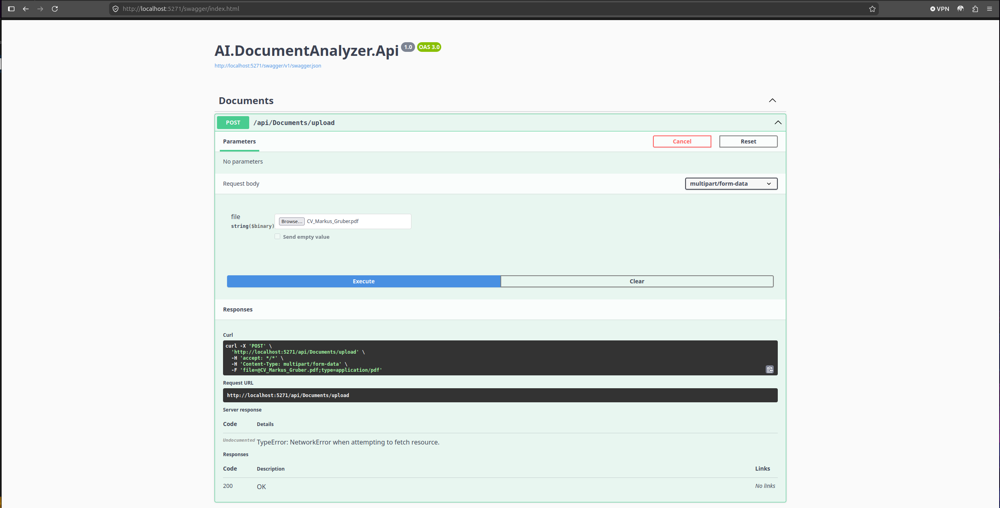
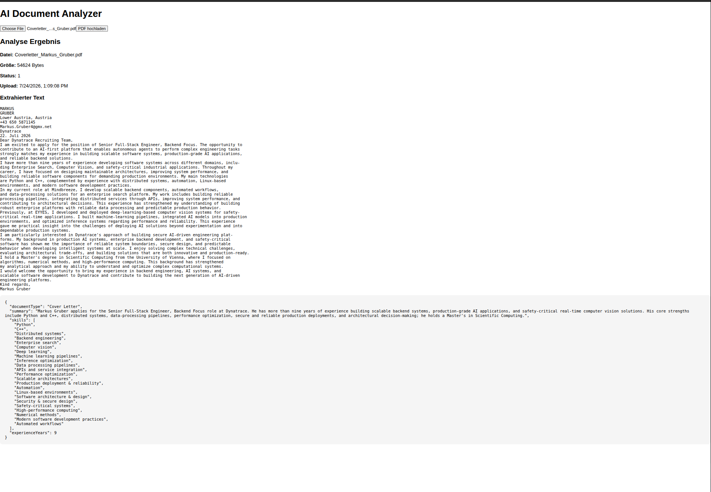
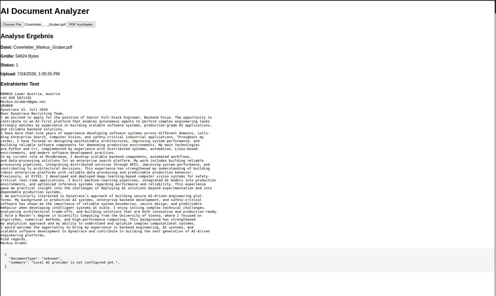

# AI Document Analyzer


## Overview

AI Document Analyzer is a full-stack AI-powered document processing application.

The application allows users to upload PDF documents, extract text content, and analyze documents using configurable Artificial Intelligence providers.

The project demonstrates an end-to-end document processing pipeline combining:

- ASP.NET Core backend development
- React frontend development
- Cloud service integration
- AI model integration
- PDF document processing
- Modular software architecture


The application supports different execution modes:

- Local Mode
- Azure Cloud Mode


The main architectural goal is to keep infrastructure components replaceable.

Storage providers, PDF extraction engines, and AI providers are implemented through interfaces and can be exchanged without changing the core application logic.


---

# Features

## Document Upload

The application allows users to upload PDF documents.

Features:

- Upload PDF files
- Validate uploaded documents
- Store documents
- Track processing status
- Extract document text


Processing workflow:

```
Upload
  |
  v
Processing
  |
  v
Analyzed
```


---

# Document Extraction

The application extracts text from PDF documents.

The extraction layer is implemented through an interface:

```
IPdfTextExtractor
```


This allows different extraction engines to be used.


## Local PDF Extraction

Technology:

- iText PDF


Advantages:

- No external services
- Fast processing
- Offline development


## Azure Document Extraction

Technology:

- Azure AI Document Intelligence


Advantages:

- Cloud-based processing
- OCR support
- Better document understanding


---

# AI Document Analysis

After text extraction, the document content is analyzed using an AI provider.

The analysis creates structured JSON output.

Example:

```json
{
  "documentType": "resume",
  "summary": "Senior Backend Engineer with experience in AI systems.",
  "skills": [
    "Python",
    "C++",
    "Azure"
  ],
  "experienceYears": 9.25
}
```


The AI response is stored as JSON.

This keeps the application flexible because different AI models can return different structures without changing the database schema.


---

# Technology Stack

## Backend

- .NET 8
- ASP.NET Core Web API
- Dependency Injection
- Repository Pattern
- Swagger / OpenAPI


## Frontend

- React
- TypeScript
- Vite


## Cloud Services

- Microsoft Azure
- Azure Blob Storage
- Azure AI Document Intelligence
- Azure OpenAI


## Local Development

Possible local providers:

- Local filesystem storage
- iText PDF extraction
- Ollama
- Local Language Models


---

# Architecture

The application follows a modular service-oriented architecture.

The system is separated into independent components:

- API Layer
- Application Services
- Infrastructure Services
- External Providers


High-level architecture:

```
                         User

                          |
                          v

                   React Frontend

                          |
                          v

                 ASP.NET Core API

                          |
        +-----------------+------------------+
        |                 |                  |
        v                 v                  v


 Storage Service   PDF Extraction     AI Analysis Service


        |                 |                  |
        |                 |                  |
        v                 v                  v


 Local Storage     iText Extractor    Local AI Provider


        |
        |
        OR


        v


 Azure Blob       Azure Document     Azure OpenAI
 Storage          Intelligence       Service

```


---

# Backend Structure

```
backend/

AI.DocumentAnalyzer.Api/

├── Controllers
│
├── Interfaces
│
├── Models
│
├── Middleware
│
├── Repositories
│
├── Services
│
├── Storage
│
└── Program.cs
```


---

# Application Flow

The complete processing pipeline:

```
User uploads PDF

        |
        v

React Frontend

        |
        v

ASP.NET Core API

        |
        v

DocumentService

        |
        +-------------------+
        |                   |
        v                   v

Storage Service      PDF Extractor

                            |
                            v

                    Extracted Text

                            |
                            v

                  AI Analysis Service

                            |
                            v

                    JSON Result

                            |
                            v

                    Frontend Display
```


# Interfaces and Provider Architecture

The application uses interfaces to separate business logic from infrastructure implementations.

This allows different providers to be exchanged without changing the application workflow.

## Storage Provider

```text
IStorageService

        |
        +-----------------------------+
        |                             |
        v                             v

LocalStorageService        AzureBlobStorageService
```

## PDF Extraction Provider

```text
IPdfTextExtractor

        |
        +-----------------------------+
        |                             |
        v                             v

PdfTextExtractorService    AzureDocumentIntelligenceService
```

## AI Analysis Provider

```text
IDocumentAnalysisService

        |
        +-----------------------------+
        |                             |
        v                             v

LocalAiDocumentAnalysisService

AzureOpenAiDocumentAnalysisService
```

The application only depends on the interfaces.

The concrete implementation is selected during application startup using Dependency Injection.

---

# Application Modes

The application supports multiple runtime modes.

The selected mode is controlled through configuration.

Available modes:

* Local
* Azure

---

# Local Mode

Local mode is intended for:

* Development
* Testing
* Offline usage
* Running without Azure resources

Architecture:

```text
React Frontend

        |

        v

ASP.NET Core API

        |

        +----------------+

        |                |

        v                v


Local Storage       Local PDF Extraction


                           |

                           v


                  Local AI Provider
```

Possible local components:

* Local filesystem storage
* iText PDF extraction
* Ollama
* Local Language Models

Advantages:

* No cloud account required
* No API costs
* Easy debugging
* Works offline

Configuration:

```json
{
  "ApplicationMode": "Local"
}
```

---

# Azure Mode

Azure mode uses managed cloud services.

Architecture:

```text
React Frontend

        |

        v

ASP.NET Core API

        |

        +---------------------------+

        |                           |

        v                           v


Azure Blob Storage       Azure Document Intelligence


                                        |

                                        v


                                  Azure OpenAI


                                        |

                                        v


                              AI Analysis Result
```

Azure services:

* Azure Blob Storage
* Azure AI Document Intelligence
* Azure OpenAI

Configuration:

```json
{
  "ApplicationMode": "Azure"
}
```

---

# Dependency Injection

Provider selection happens during application startup.

The application checks the configured mode and registers the required implementations.

Example:

```csharp
var mode =
    builder.Configuration["ApplicationMode"];


if(mode == "Azure")
{
    builder.Services.AddSingleton<
        IStorageService,
        AzureBlobStorageService>();

    builder.Services.AddScoped<
        IPdfTextExtractor,
        AzureDocumentIntelligenceService>();

    builder.Services.AddScoped<
        IDocumentAnalysisService,
        OpenAiDocumentAnalysisService>();
}
else
{
    builder.Services.AddSingleton<
        IStorageService,
        LocalStorageService>();

    builder.Services.AddScoped<
        IPdfTextExtractor,
        PdfTextExtractorService>();

    builder.Services.AddScoped<
        IDocumentAnalysisService,
        LocalAiDocumentAnalysisService>();
}
```

This design allows switching between cloud and local execution without changing the application logic.

---

# Configuration

The application configuration is stored in:

```text
appsettings.json
```

Example:

```json
{
  "ApplicationMode": "Azure",

  "AzureBlobStorage": {
    "ConnectionString": "",
    "ContainerName": "documents"
  },

  "DocumentIntelligence": {
    "Endpoint": "",
    "ApiKey": ""
  },

  "AzureOpenAI": {
    "Endpoint": "",
    "ApiKey": "",
    "DeploymentName": ""
  }
}
```

---

# Azure Setup

The Azure implementation requires three main services:

1. Azure Blob Storage
2. Azure AI Document Intelligence
3. Azure OpenAI

---

# Azure Blob Storage Setup

Create a new Azure resource:

```text
Storage Account
```

Create a container:

```text
documents
```

Retrieve the connection string:

```text
Storage Account

    |
    +── Security + networking

            |
            +── Access keys

                    |
                    +── Connection String
```

Configuration:

```json
{
  "AzureBlobStorage": {
    "ConnectionString": "YOUR_CONNECTION_STRING",
    "ContainerName": "documents"
  }
}
```

Uploaded PDF documents are stored inside this container.

---

# Azure AI Document Intelligence Setup

Create:

```text
Azure AI Document Intelligence
```

After creation open:

```text
Keys and Endpoint
```

Copy:

```text
Endpoint
API Key
```

Configuration:

```json
{
  "DocumentIntelligence": {
    "Endpoint": "https://YOUR_RESOURCE.cognitiveservices.azure.com/",
    "ApiKey": "YOUR_KEY"
  }
}
```

The service extracts text from uploaded PDF documents.

---

# Azure OpenAI Setup

Create:

```text
Azure OpenAI Resource
```

Create a model deployment.

Example:

```text
Model:

gpt-4.1-mini


Deployment name:

document-analyzer
```

Important:

The deployment name is not the same as the model name.

The application uses the deployment name.

Configuration:

```json
{
  "AzureOpenAI": {
    "Endpoint": "https://YOUR_RESOURCE.openai.azure.com/",
    "ApiKey": "YOUR_KEY",
    "DeploymentName": "document-analyzer"
  }
}
```

---

# Security Configuration

Sensitive information should never be committed into Git.

Do not commit:

```text
API Keys

Connection Strings

Azure Credentials

Secrets
```

Recommended options:

## Development Configuration

Use:

```text
appsettings.Development.json
```

Example:

```json
{
  "AzureOpenAI": {
    "ApiKey": "secret"
  }
}
```

## Environment Variables

ASP.NET Core automatically maps environment variables.

Example:

```text
AzureOpenAI__ApiKey

AzureBlobStorage__ConnectionString

DocumentIntelligence__ApiKey
```

# Backend Startup

The backend is implemented as an ASP.NET Core Web API application.

## Requirements

Before starting the application, install:

* .NET 8 SDK
* Node.js
* npm

Check installed versions:

```bash
dotnet --version

node --version

npm --version
```

---

# Starting the Backend

Navigate into the backend project:

```bash
cd backend/AI.DocumentAnalyzer.Api
```

Restore all NuGet packages:

```bash
dotnet restore
```

Build the application:

```bash
dotnet build
```

Start the API:

```bash
dotnet run
```

Example output:

```text
Building...

info: Microsoft.Hosting.Lifetime
      Now listening on:
      https://localhost:7001

Application started.
```

The API is now available.

---

# Swagger API Documentation

The backend provides an automatically generated Swagger interface.

Open:

```text
https://localhost:7001/swagger
```

Swagger allows testing all API endpoints without a separate frontend.

Available operations include:

* Upload documents
* Retrieve document information
* Trigger analysis
* View processing results

Example:

```text
POST /api/documents/upload
```

Uploads a PDF document into the system.

---

# Starting the Frontend

The frontend is implemented using React and TypeScript.

Navigate to the frontend folder:

```bash
cd frontend
```

Install dependencies:

```bash
npm install
```

Start the development server:

```bash
npm run dev
```

Example output:

```text
VITE ready

Local:

http://localhost:5173/
```

Open the application:

```text
http://localhost:5173/
```

---

# Complete Development Startup

A complete local development startup consists of two running processes.

## Terminal 1 - Backend

```bash
cd backend/AI.DocumentAnalyzer.Api

dotnet run
```

Backend:

```text
https://localhost:7001
```

## Terminal 2 - Frontend

```bash
cd frontend

npm install

npm run dev
```

Frontend:

```text
http://localhost:5173
```

---

# Document Processing Workflow

The complete document analysis workflow:

```text
                User

                 |

                 v

          React Frontend

                 |

                 v

        Upload PDF Document

                 |

                 v

        ASP.NET Core API

                 |

                 v

          DocumentService

                 |

        +--------+---------+

        |                  |

        v                  v


 Storage Service     PDF Extraction


        |                  |

        |                  v

        |            Extracted Text

        |                  |

        +--------+---------+

                 |

                 v

       IDocumentAnalysisService

                 |

        +--------+---------+

        |                  |

        v                  v


 Local AI Provider     Azure OpenAI


                 |

                 v

          JSON Analysis Result

                 |

                 v

          Frontend Display
```

---

# API Response Example

After uploading a document, the API returns the extracted document information.

Example:

```json
{
  "id": "86daf8d8-0fb9-4228-8198-a8b86ecae3b6",
  "fileName": "Coverletter_Markus_Gruber.pdf",
  "fileSize": 54624,
  "uploadedAt": "2026-07-24T07:48:45Z",
  "status": 2,
  "extractedText": "MARKUS GRUBER..."
}
```

The extracted text is stored together with the document metadata.

---

# AI Analysis Result

After AI processing, the analysis result is stored as JSON.

Example:

```json
{
  "documentType": "resume",
  "summary": "Senior Backend Engineer with experience in scalable backend systems and AI applications.",
  "skills": [
    "Python",
    "C++",
    "Azure",
    "Machine Learning",
    "Distributed Systems"
  ],
  "experienceYears": 9.25
}
```

The result can be used for:

* CV analysis
* Cover letter analysis
* Document classification
* Skill extraction
* Automated document processing

---

# Project Configuration Flow

The application decides which provider to use during startup.

Example:

```text
appsettings.json

        |

        v

ApplicationMode

        |

        +----------------+

        |                |

        v                v


     Local            Azure


        |                |

        v                v


Local Services    Cloud Services
```

This allows running the same application:

* Completely offline
* With Azure cloud services
* With different AI providers

without modifying business logic.

---

# Error Handling

The API contains centralized exception handling.

Architecture:

```text
Controller

    |

    v

Service Layer

    |

    v

ExceptionMiddleware

    |

    v

HTTP Response
```

Unhandled exceptions are converted into consistent API responses.

Example:

```json
{
  "message": "Interner Serverfehler"
}
```

This prevents internal implementation details from being exposed to clients.

---

# Repository Pattern

Database and persistence logic are separated through repositories.

Example:

```text
DocumentService

        |

        v

DocumentRepository

        |

        v

Database
```

Benefits:

* Cleaner business logic
* Easier testing
* Replaceable persistence layer
* Better separation of concerns

---

# Service Responsibilities

## DocumentService

Responsible for:

* Receiving uploaded files
* Starting extraction
* Triggering AI analysis
* Updating document state

## StorageService

Responsible for:

* Saving files
* Retrieving files
* Managing storage location

## PdfTextExtractor

Responsible for:

* Reading PDF files
* Extracting text
* Returning document content

## DocumentAnalysisService

Responsible for:

* Sending text to AI providers
* Processing AI responses
* Returning structured analysis results

---

# Screenshots

Recommended screenshots for the project documentation:

## Application Overview

Insert:

```text
docs/images/application-overview.png
```

Example:



## AI Analysis Result



## Without AI Analysis Result


